# Planejamento de Qualidade

## Objetivo

De acordo com a definição do guia PMBOK, a qualidade seria “o grau até o qual um conjunto de características inerentes satisfaz as necessidades”. Dessa forma, com o objetivo de detectar não conformidades dentro do projeto e estabelecer ações corretivas e preventivas para que seja possível entregar um produto que possua um grau elevado de satisfação para o usuário final, serão abordadas neste Planejamento de Qualidade, práticas, recursos e parâmetros que permitam ao time atingir esse objetivo.

Para isso faremos o uso da abordagem **GQM** (Goal Question Metrics) que é uma abordagem de cima para baixo (top-down) que estabelece um sistema de medição direcionado a metas para desenvolvimento de software em que a equipe inicia com metas organizacionais, define a medição das metas, levanta questões a abordar os objetivos e identifica as métricas que proporcionem as respostas. O modelo GQM está dividido em três níveis: Nível Conceitual, nível operacional e nível quantitativo.

Essa abordagem possui 3 níveis hierárquicos, são eles:

**Conceitual (Objetivos):** Uma meta é definida para algum objeto de medição, esse objeto pode ser produtos, processos ou recursos
**Operacional (Questões):** Elaborar perguntas que nos ajudam a caracterizar o objeto de medição e nos ajuda a escolher o ponto de vista da análise de qualidade que será feita.
**Quantitativo (Métricas):** Conjunto de dados que está associado às perguntas a fim de respondê-las.

## Goals

### Objetivo 1 - Qualidade a Nível Organizacional

Para que seja possível medir a qualidade organizacional é necessário primeiramente definir os aspectos que serão avaliados dentro desse contexto. Pretende-se avaliar, por exemplo, a produtividade do time, capacitação do time, e padronização de processos dentro da equipe. A medição da qualidade a nível organizacional permite ao próprio time uma autonomia para tomar decisões e gerar uma melhoria contínua nas entregas de releases.

Conforme propõe a ISO/IEC 14598-1 que está direcionada ao ponto de vista de desenvolvedores que pretendem desenvolver um novo produto ou melhorar um produto existente e pretendam executar avaliação de produto utilizando pessoas de seu próprio corpo técnico pode-se fazer o uso de indicadores que ajudam a prever a qualidade do produto final através da medição de produtos intermediários desenvolvidos durante o ciclo de vida.

Para obtermos métricas de qualidade a nível organizacional, foram escolhidos os seguintes aspectos para serem avaliados:

| Goal | Questions                                                                                                          | Metrics                                                                                         |
| ---- | ------------------------------------------------------------------------------------------------------------------ | ----------------------------------------------------------------------------------------------- |
| 1    | O time realiza treinamentos? Existe progresso de conhecimento das tecnologias? Os membros participam das reuniões? | Quadro de conhecimentos, Burndown, Velocity, Frequência de participação nas cerimonias do Scrum |

### Objetivo 2 - Qualidade a Nível de Projeto

Para avaliar a qualidade a nível de projeto serão coletadas métricas, por meio do SonarCloud após cada *Pull Request* submetido e cujo *merge* tenha sido realizado. Após coletadas, essas métricas são combinadas para calcular cada um dos aspectos de qualidade que interessa a este Projeto, estando esses divididos em:

- Manutenibilidade do código
- Confiabilidade

| Goal | Questions                                                                                                  | Metrics                                                                                                                                                                |
| ---- | ---------------------------------------------------------------------------------------------------------- | ---------------------------------------------------------------------------------------------------------------------------------------------------------------------- |
| 2    | O código é reaproveitado? O código é legível? Após inserir novas funcionalidades é fácil identificar bugs? | files,functions, complexity, comment_lines_density, duplicated_lines_density, coverage, ncloc, tests, test_errors, test_failures, test_execution_time, security_rating |

**Aspecto Manutenibilidade**
#### Fator *Code Quality*

O conjunto de métricas abaixo, referentes ao fator de qualidade *Code Quality* que compõe o aspecto de qualidade Manutenibilidade, será coletado para avaliar a manutenibilidade do código do projeto. Tal aspecto é importante por nos permitir avaliar o quão fácil será realizar a manutenção no código do projeto.

1. **Complexidade**

Essa métrica tem por objetivo identificar a densidade de arquivos não complexos, sendo estes definidos como os arquivos que estão fora do limite de complexidade ciclomática definido (por padrão 10).

<strong>Densidade de arquivos não complexos</strong> 
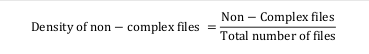 
Fonte: Próprio autor

Obs.: onde um arquivo complexo é definido como aquele cuja complexidade ciclomática por função é maior que 10 (valor padrão). A Complexidade Ciclomática contabiliza quantos caminhos possíveis um fluxo inicial de código pode assumir.

2. **Comentários**

Essa métrica tem como objetivo identificar a densidade de arquivos comentados. Um arquivo é tido como comentado se a sua densidade de linhas comentadas estiver dentro do limite definido (entre 10% e 30% por padrão).

<strong>Densidade de arquivos comentados</strong> 
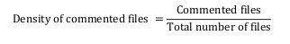 
Fonte: Próprio autor

<strong>Densidade de linhas comentadas</strong> 
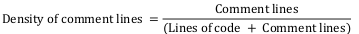 
Fonte: Próprio autor

3. **Duplicidade**

Essa métrica avalia a quantidade de arquivos abaixo do limite definido para a porcentagem de linhas duplicadas. Onde, um arquivo é definido como não havendo duplicações se a sua densidade de duplicação é menor que 5% (valor padrão estabelecido).

<strong>Ausência de duplicações</strong> 
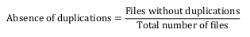 
Fonte: Próprio autor

<strong>Densidade de duplicação</strong> 
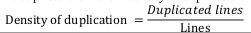 
Fonte: Próprio autor

### Cálculo Manutenibilidade e Interpretação

Tendo cada uma das 3 métricas acima calculadas partimos para o cálculo do fator de qualidade *Code Quality*, sendo o único fator de qualidade que compõe o aspecto de qualidade Manutenibilidade e, portanto, seu resultado definirá tal aspecto. O cálculo é definido como:

<strong>Manutenibilidade (Qualidade de Código)</strong> 
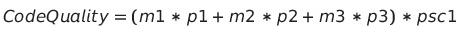 
Fonte: Próprio autor

<strong>Constantes na Equação Qualidade de Código</strong> 
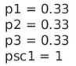 
Fonte: Próprio autor

Onde, m1, m2 e m3 remetem a Complexidade, Comentários e Duplicidade, respectivamente. O resultado final é um valor entre 0 e 1 (0: péssimo, 1: excelente)

**Aspecto Confiabilidade**

Para mensurar esse aspecto é necessário antes o cálculo do fator de qualidade *Testing Status*. Esse aspecto é importante para avaliar o quão confiável o código é em realizar aquilo que propõe.
#### Fator *Testing Status*
A fim de mensurá-lo, são necessárias 3 métricas: *Passed Tests*, *Fast Test Builds* e *Test Coverage*.

1. ***Passed tests***

Calcula a densidade de testes unitários com sucesso. É definida como:

<strong>Quantidade de testes com sucesso</strong> 
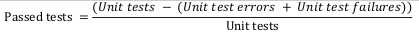 
Fonte: Próprio autor

2. ***Fast Test Builds***

Tem como objetivo o cálculo das *builds* de teste cuja duração esteja abaixo do limite definido (300 segundos).

<strong>Construções de teste rápidas</strong> 
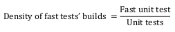 
Fonte: Próprio autor

Obs.: *fast unit test* são os testes cuja duração de execução está abaixo de 300 segundos.

3. ***Test Coverage***

Avalia a cobertura de código do Projeto considerando os arquivos de teste unitários que estejam acima do limite definido (60% por padrão).

<strong>Cobertura de código</strong> 
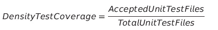 
Fonte: Próprio autor

Obs.: Onde *AcceptedUnitTestFiles* são aqueles arquivos de teste unitário que testam ao menos 60% do código de seu componente alvo para o qual foi implementado.

### Cálculo Confiabilidade e Interpretação
Finalmente partimos para o cálculo do fator de qualidade *Testing Status* que, por ser o único fator de qualidade que compõe o aspecto Confiabilidade, definirá o seu valor final.

<strong>Cálculo fator Testing Status</strong> 
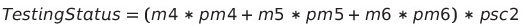 
Fonte: Próprio autor

<strong>Constantes na equação Testing Status</strong> 
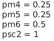 
Fonte: Próprio autor

Onde, m4, m5 e m6 remetem a *Passed Tests*, *Fast Test Builds* e *Coverage*, respectivamente. O resultado final é um valor entre 0 e 1 (0: péssimo, 1: excelente)

**SEGURANÇA**

A métrica abaixo será utilizada para calcular a segurança do projeto baseado nas vulnerabilidades encontradas no mesmo.

Será avaliado utilizando a seguinte métrica:

**security_rating;**

### Objetivo 3 - Qualidade na Visão do Usuário

É importante considerar que o cliente é quem está à frente. Ele tem o direito de participar e opinar durante o processo de construção do software. Neste contexto, a experiência do usuário, além das qualidades técnicas do software, é um fator determinante para a construção de sistemas de maior qualidade. Sua participação pode facilitar a compreensão dos seus desejos quanto ao software que está sendo desenvolvido. Esse aspecto da qualidade do software é chamado usabilidade.

Dessa forma, para medirmos a usabilidade será desenvolvido e disponibilizado um formulário para o cliente e conforme ele for testando as novas funcionalidades implementadas será possível ele avaliar em uma escala de 0 a 10 questões qualitativas do quão intuitivo e prático foi sua experiência ao utilizar a aplicação.

| Goal | Questions                                                                                                                                                                                                                                                                        | Metrics                                                                     |
| ---- | -------------------------------------------------------------------------------------------------------------------------------------------------------------------------------------------------------------------------------------------------------------------------------- | --------------------------------------------------------------------------- |
| 3    | As funcionalidades estão disponíveis e são executadas eficientemente? O aplicativo funciona corretamente sem imprevistos? O software é seguro, ou seja, evita que pessoas ou sistemas não autorizados tenham acesso às informações? É fácil de usar ou requer muito treinamento? | Respostas do forms que serão analisadas conforme o cliente usar a aplicação |

**Histórico de Versão**

| Data       | Versão | Descrição                                                      | Autor(es)                 |
| ---------- | ------ | -------------------------------------------------------------- | ------------------------- |
| 15/07/2022 | 0.1    | Criação do plano de qualidade e adição do tópico de introdução | Nathalia, Luciano e Pedro |
| 15/07/2022 | 0.2    | Adição do tópico de objetivos                                  | Nathalia, Luciano e Pedro |
| 18/07/2022 | 0.3    | Adição do tópico de Abordagens e metodologias                  | Nathalia, Luciano e Pedro |
| 18/07/2022 | 0.4    | Atualização do tópico de Abordagens e metodologias             | Nathalia, Luciano e Pedro |
| 18/07/2022 | 0.5    | Adição do tópico de Qualidade a Nível Organizacional           | Nathalia, Luciano e Pedro |
| 18/07/2022 | 0.6    | Adição do tópico de Qualidade a Nível de Projeto               | Nathalia, Luciano e Pedro |
| 18/07/2022 | 0.7    | Adição do tópico de Qualidade na Visão de Usuário              | Nathalia, Luciano e Pedro |
| 18/07/2022 | 0.8    | Adição de Referências                                          | Nathalia, Luciano e Pedro |
| 31/07/2022 | 0.9    | Refatorando o documento                                        | Nathalia                  |

## Referências

> RODRIGUES, Claudia. A importância de um plano de qualidade de software e a estratégia de testes. Linkedin, 2017. Disponível em: <https://www.linkedin.com/pulse/import%C3%A2ncia-de-um-plano-qualidade-software-e-testes-farias-ctfl/?originalSubdomain=pt>. Acesso em: 30 de jul. de 2022.

> ARIAS, Raphael. Como criar um plano de gerenciamento da qualidade. Excellence Blog, 2020. Disponível em: <https://blog.softexpert.com/plano-gerenciamento-qualidade/>. Acesso em: 30 de jul. de 2022.

> SILVA, C. V. P. GQM - Goal Question Metric. Ago 2009. Disponível em: <https://www.cin.ufpe.br/~scbs/metricas/seminarios/GQM_texto.pdf> Acesso em: 30 jul. 2022.

> CAMPOS, Fábio. Qualidade, Qualidade de Software e Garantia da Qualidade de Software são as mesmas coisas?. Linha de Código, 2022. Disponível em: <http://www.linhadecodigo.com.br/artigo/1712/qualidade-qualidade-de-software-e-garantia-da-qualidade-de-software-sao-as-mesmas-coisas.aspx>. Acesso em: 30 jul. 2022.

> LENILDO. Qualidade de Software - Engenharia de Software 29. DEVMEDIA, 2010. Disponível em: <https://www.devmedia.com.br/qualidade-de-software-engenharia-de-software-29/18209>. Acesso em: 30 jul. 2022.

> ASSOCIAÇÃO BRASILEIRA DE NORMAS TÉCNICAS. NBR ISO/IEC 14598-1: Tecnologia de informação: Avaliação de produto de software. Rio de Janeiro, p. 07. 2001.
