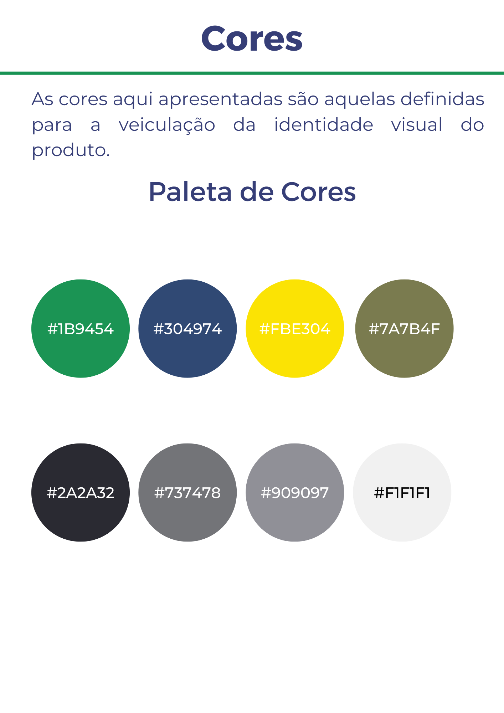

# Identidade Visual

**Histórico de Versão**

| Data       | Versão | Descrição            | Autor(es)         |
| ---------- | ------ | -------------------- | ----------------- |
| 22/07/2022 | 0.1    | Criação do documento | Francisco, Maicon |

## Referências

> How to create a visual style guide for your brand. Disponível em: https://www.canva.com/learn/your-brand-needs-a-visual-style-guide/
