# Protótipo de Baixa Fidelidade

## Telas

Login do usuario  
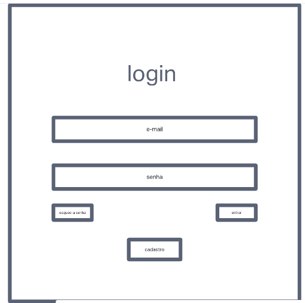

Cadastro feito pelo usuario  
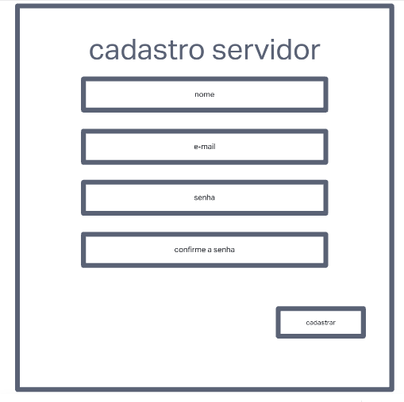

Tela principal/de processos  
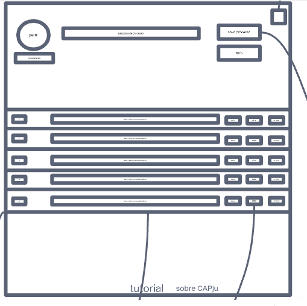

Adicionar novo processo  
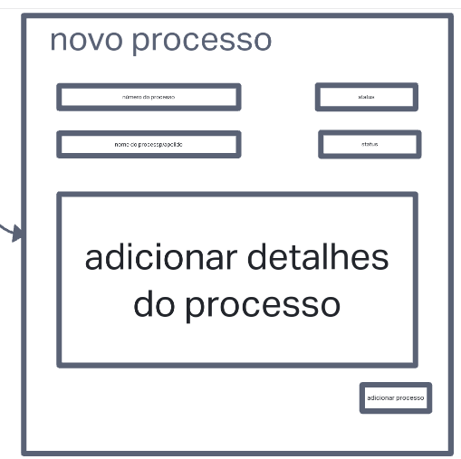

Detalhe do processo  
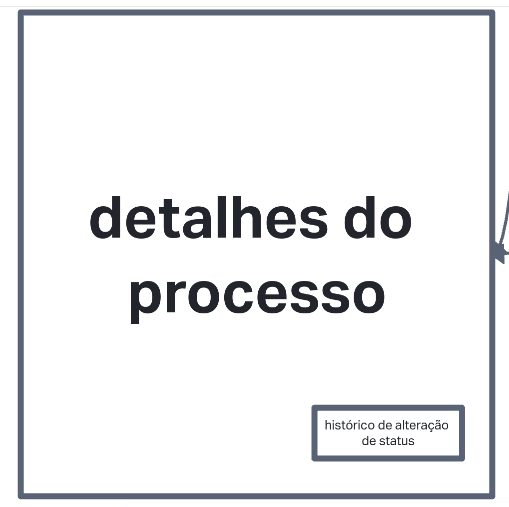

Editar processo  
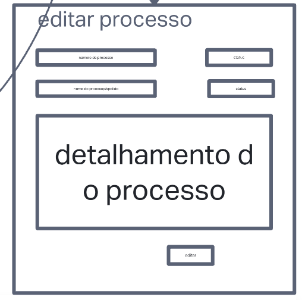

Menu de opções  
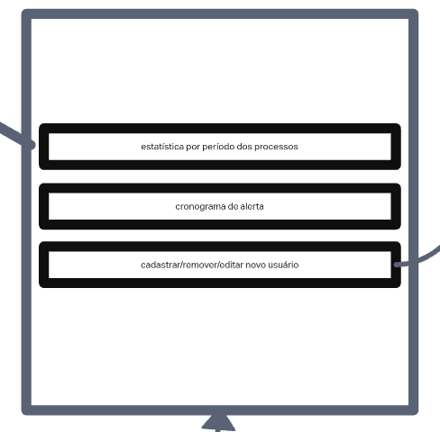

Cadastrar/remover/editar usuario  
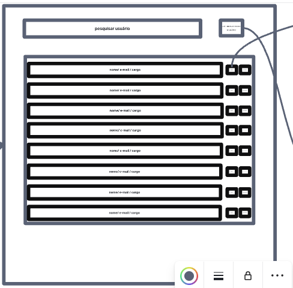

Cadastro feito pelo diretor  
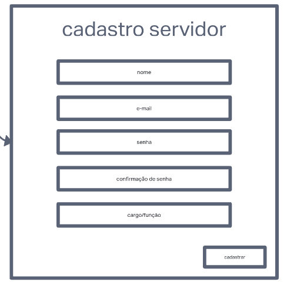

Editar servidor  
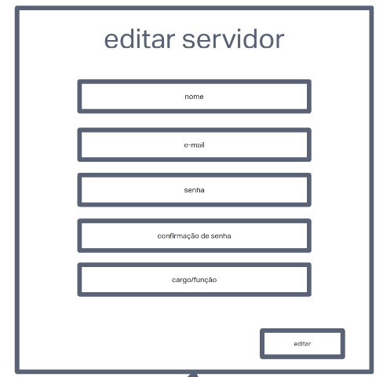

Gerar grafico  
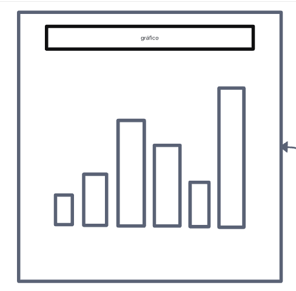

Tutorial  
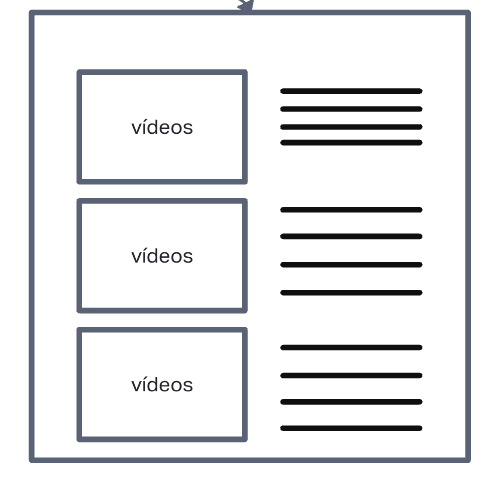

**Histórico de Versão**

| Data       | Versão | Descrição                                | Autor(es)            |
| ---------- | ------ | ---------------------------------------- | -------------------- |
| 22/07/2022 | 0.1    | Criação do Protótipo de baixa fidelidade | Hellen, Lucas Caldas |
